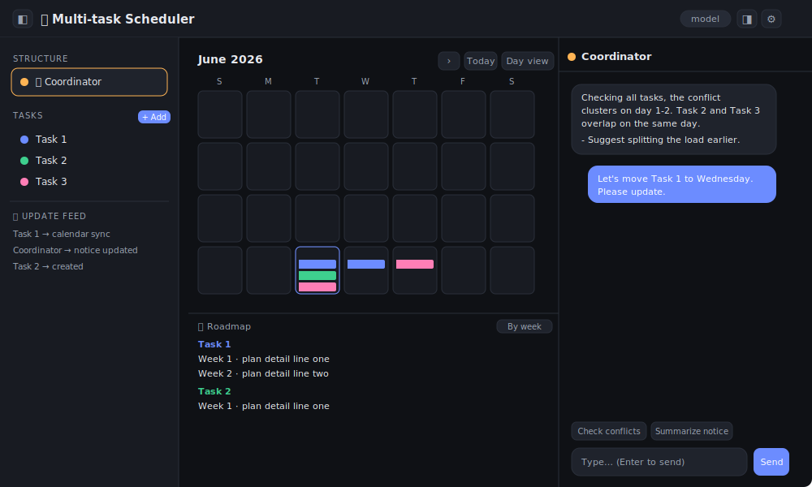
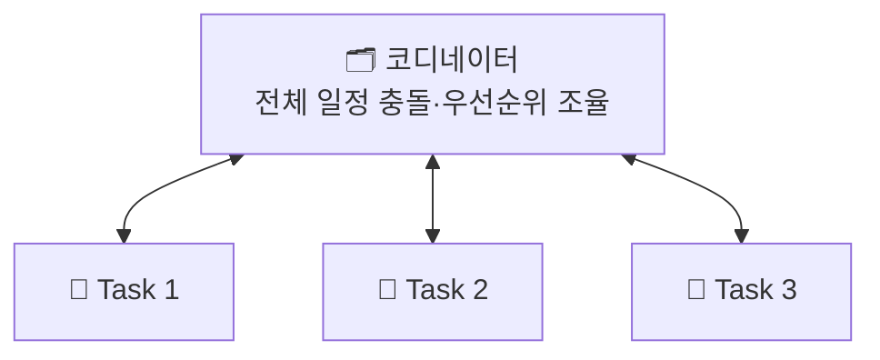
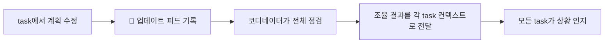

# 🎯 멀티 task 스케줄러

여러 목표(task)를 각각 독립된 채팅으로 관리하고, **코디네이터**가 전체 일정을 조율하는 로컬 웹 앱입니다. 데이터는 브라우저(localStorage)에 저장되고, Anthropic API로 계획을 세우고 수정합니다.

## 🖼️ 인터페이스

> 실제 스크린샷으로 바꾸려면 `docs/` 폴더에 이미지(예: `screenshot.png`)를 넣고 위 줄을 `` 로 수정하세요.

왼쪽은 구조·task 목록·업데이트 피드, 가운데는 모든 task를 색상별로 표시하는 통합 캘린더(월별·일별 토글), 오른쪽은 선택한 노드의 채팅입니다.

## 🧩 구조

허브-스포크 구조입니다. 각 task는 독립된 채팅으로 서로 직접 소통하지 않고, 변화가 생기면 코디네이터를 거쳐 모두가 공유합니다.

각 task는 코디네이터와만 양방향으로 연결됩니다. 위로는 task → 코디네이터로 계획·진행이 보고되고, 아래로는 코디네이터 → task로 공지·조율 컨텍스트가 전달됩니다. task끼리는 직접 소통하지 않습니다.

업데이트 전파 흐름:

## 🚀 사용법

1. `config.example.js` 를 복사해 `config.js` 로 저장하고 Anthropic API 키 입력
2. `scheduler.html` 을 브라우저로 열기
3. `+ 추가` 로 task를 만들고 목표를 입력하면 계획이 생성됨
4. `📅 캘린더에 반영` 으로 계획을 캘린더에 표시
5. 코디네이터에서 `충돌 점검` 으로 전체 일정 조율

## ✨ 기능

- task별 독립 채팅 + 코디네이터 전체 조율
- 색상별 통합 캘린더 (월별 / 일별 보기 토글)
- 로드맵 task별 / 주차별 보기 토글
- 좌·우 패널 접기, 데이터 백업(JSON) 내보내기

## 🔒 보안

- API 키가 든 `config.js` 는 `.gitignore` 로 제외되어 커밋되지 않습니다.
- 키는 브라우저에 저장되지 않고 `config.js` 파일에서만 읽습니다.
